## Complex Real-world Mermaid Chart Examples

### 1. Flowchart – Order Fulfillment System
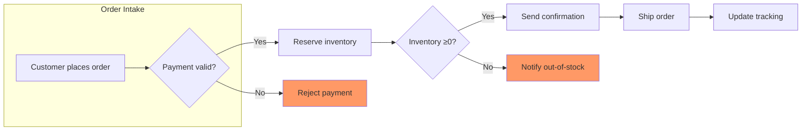

### 2. Sequence Diagram – API Authentication & Data Fetch
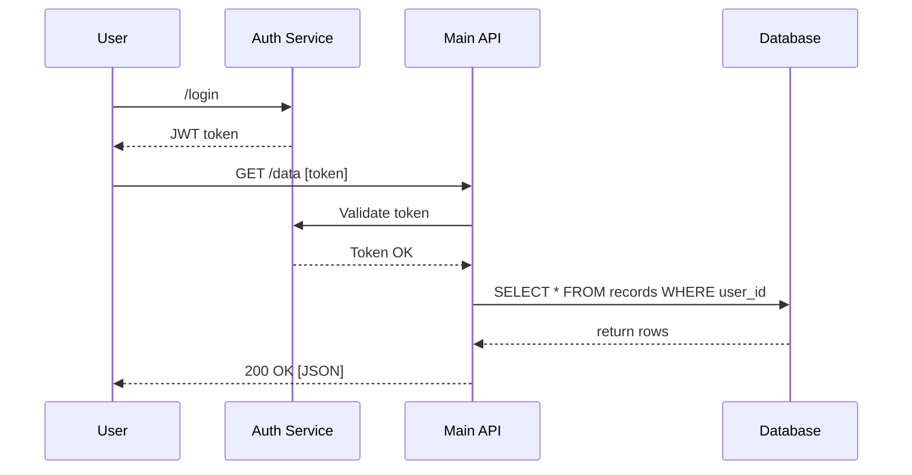

### 3. Class Diagram – E‑commerce Domain
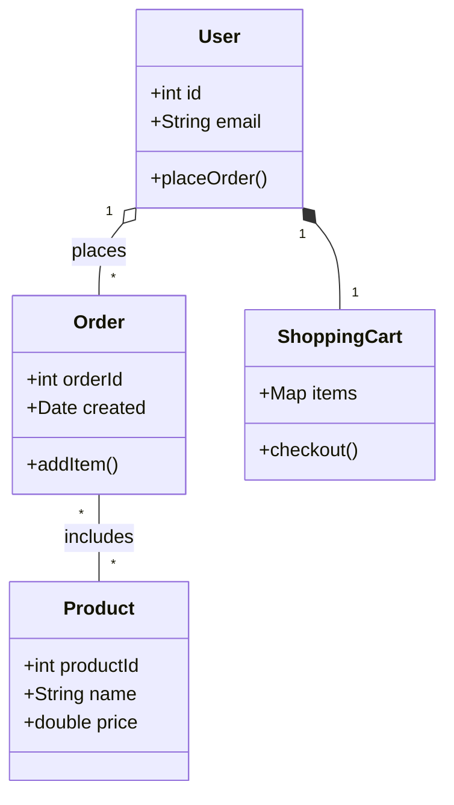

### 4. Entity‑Relationship Diagram – SaaS Schema
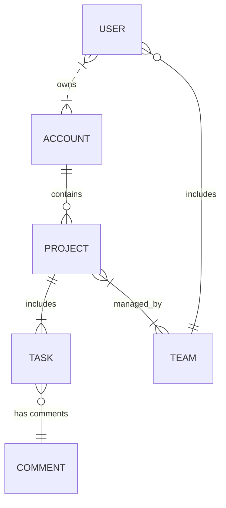

### 5. Gantt Chart – Sprint Planning
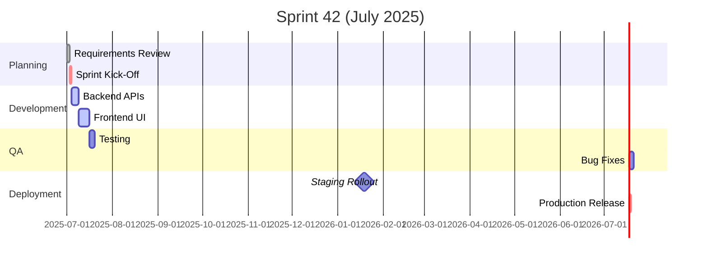

### 6. Mindmap – Product Ideation
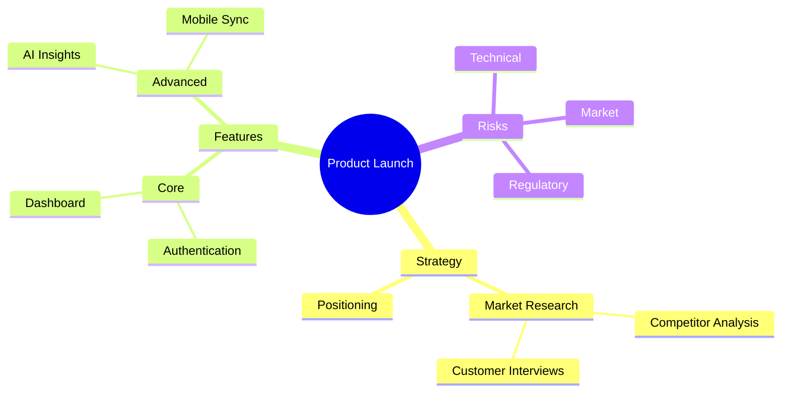

### 7. State Diagram – Order Lifecycle
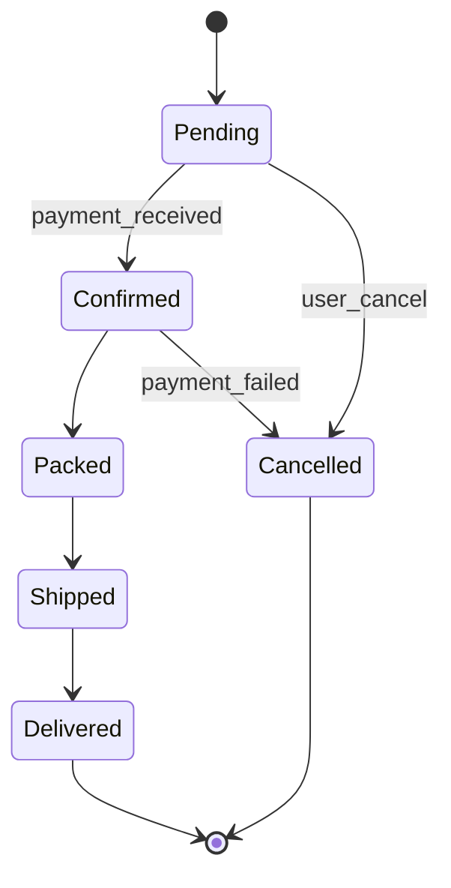

### 8. User Journey – Mobile App Onboarding
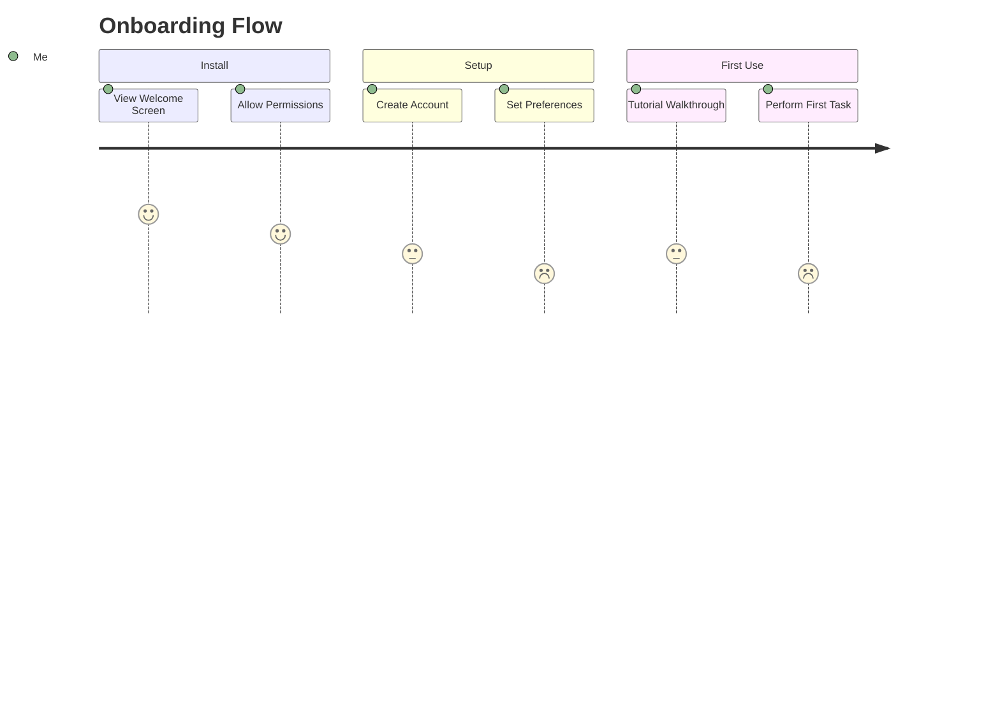

### 9. Requirement Diagram – Compliance App
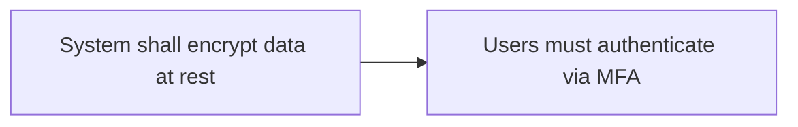

### 10. Git Graph – Release Workflow
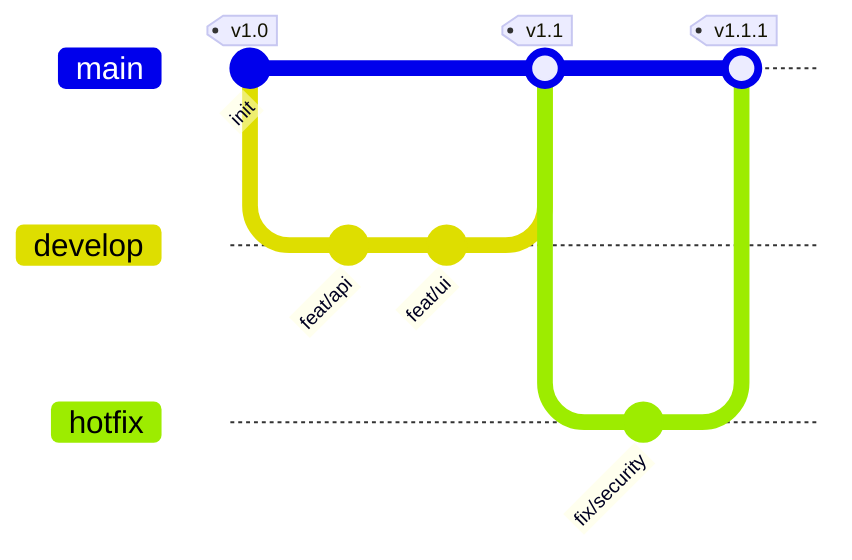

### 11. C4 Context Diagram – Microservices
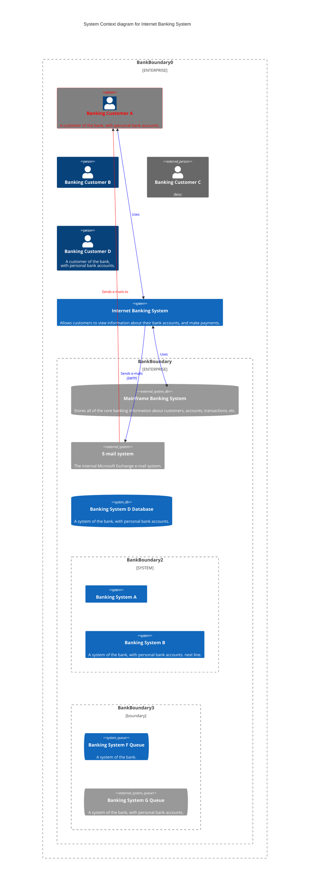

### 12. Timeline – Product Roadmap
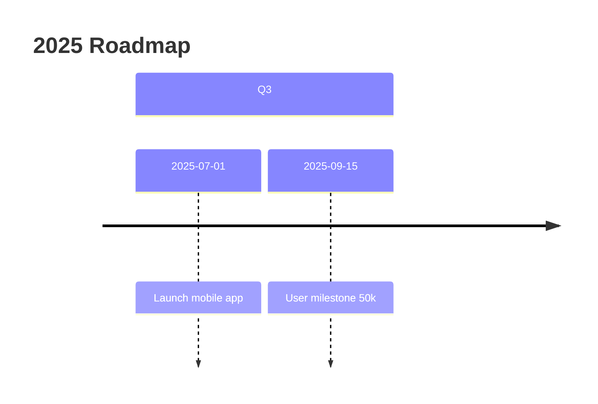

### 13. Pie Chart – Market Share
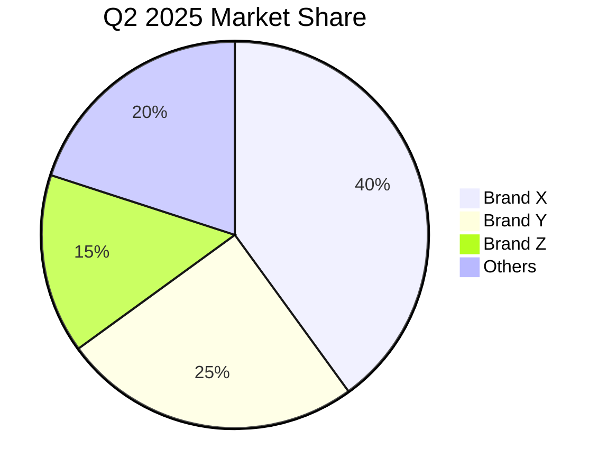

### 14. Quadrant Chart – Risk Matrix
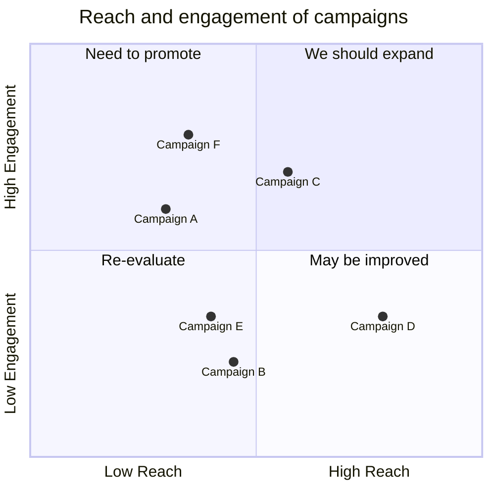

### 15. Sankey Diagram – User Onboarding Funnel
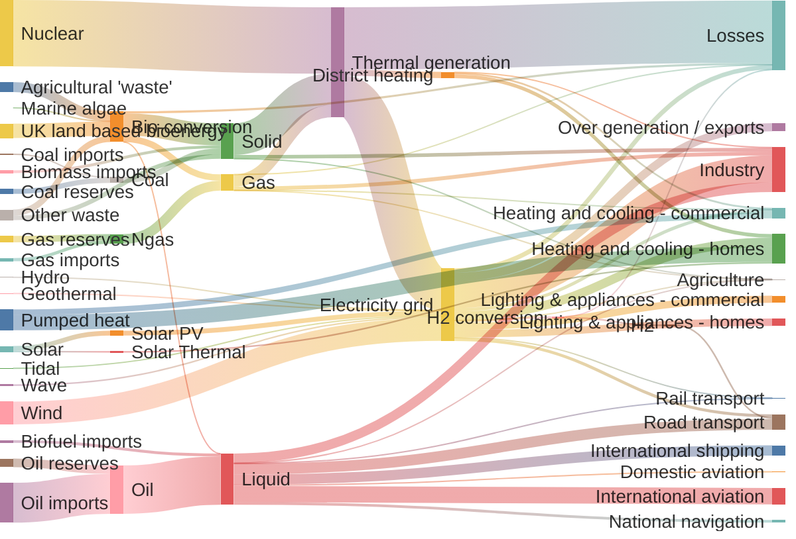

### 16. XY (Scatter) – Sales vs. Marketing Spend
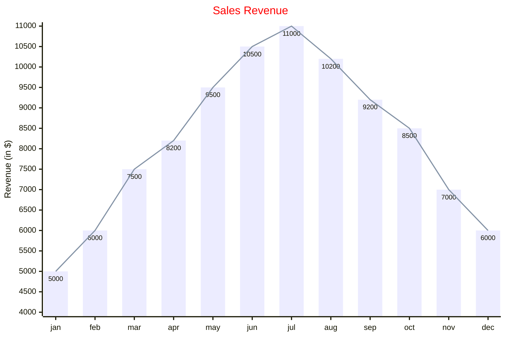

### 17. Block Diagram – System Architecture
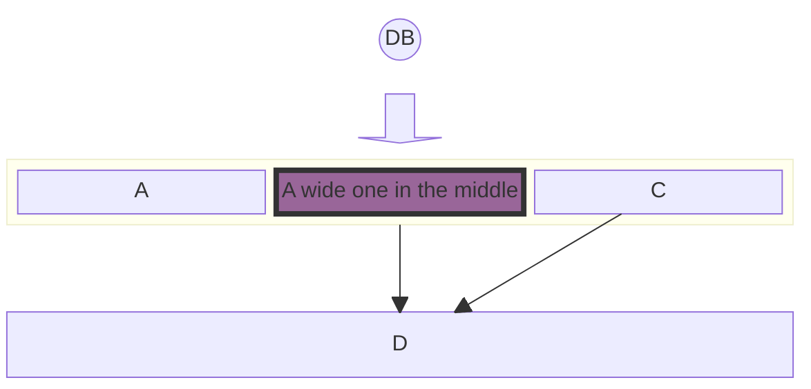

### 18. Packet Diagram – Network Frame
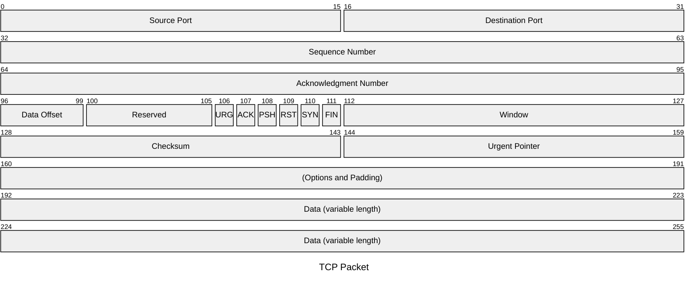

### 19. Kanban Board – Release Tracker
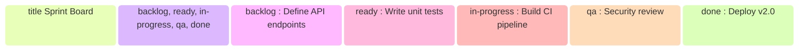

### 20. Architecture Diagram – Service Mesh
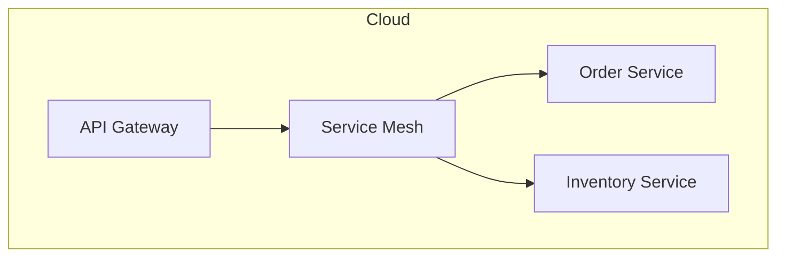

### 21. Radar Chart – Team Skills
```mermaid
---
title: "Grades"
---
radar-beta
  axis m["Math"], s["Science"], e["English"]
  axis h["History"], g["Geography"], a["Art"]
  curve a["Alice"]{85, 90, 80, 70, 75, 90}
  curve b["Bob"]{70, 75, 85, 80, 90, 85}

  max 100
  min 0
```

### 22. Treemap – Revenue by Region
```mermaid
---
config:
    theme: 'forest'
---
treemap-beta
"Category A"
    "Item A1": 10
    "Item A2": 20
"Category B"
    "Item B1": 15
    "Item B2": 25
```
