## Complex Real-world Mermaid Chart Examples

### 1. Flowchart – Order Fulfillment System
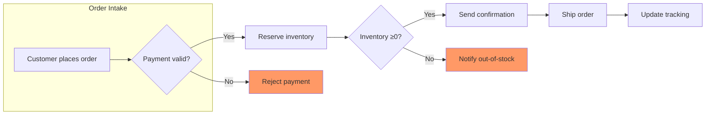

### 2. Sequence Diagram – API Authentication & Data Fetch
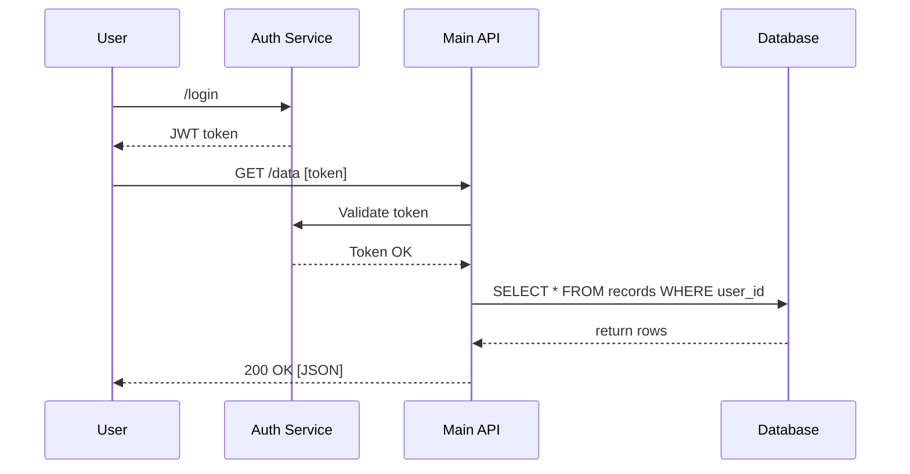

### 3. Class Diagram – E‑commerce Domain
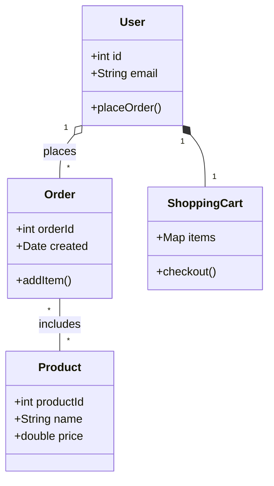

### 4. Entity‑Relationship Diagram – SaaS Schema
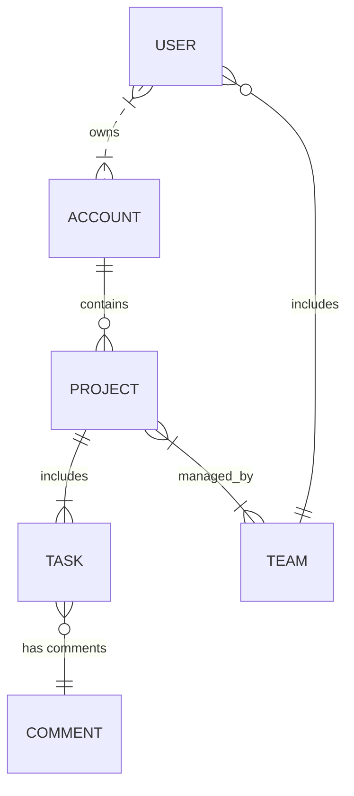

### 5. Gantt Chart – Sprint Planning
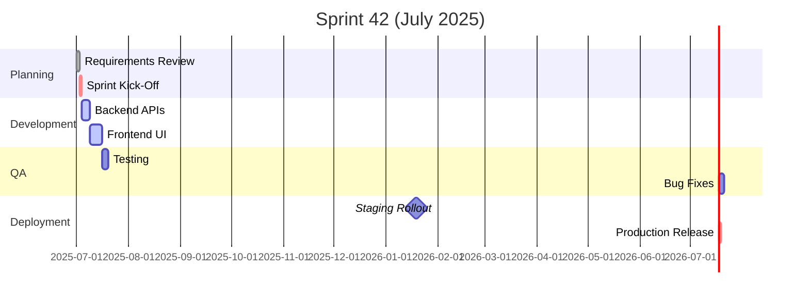

### 6. Mindmap – Product Ideation
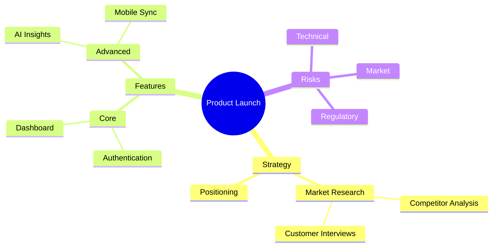

### 7. State Diagram – Order Lifecycle
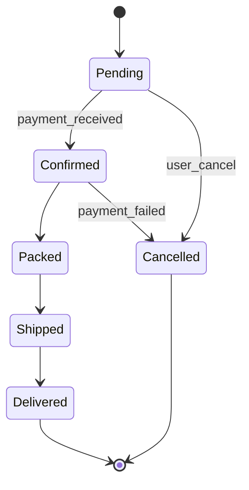

### 8. User Journey – Mobile App Onboarding
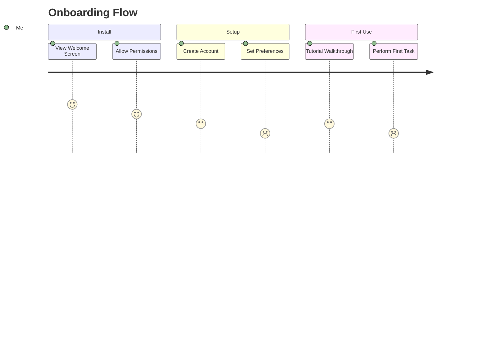

### 9. Requirement Diagram – Compliance App
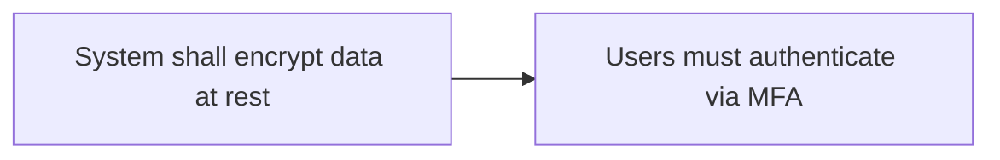

### 10. Git Graph – Release Workflow
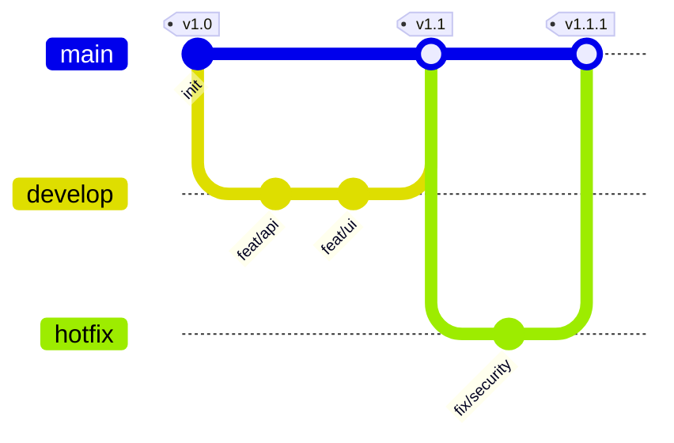

### 11. C4 Context Diagram – Microservices
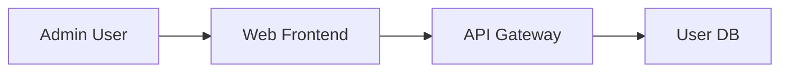

### 12. Timeline – Product Roadmap
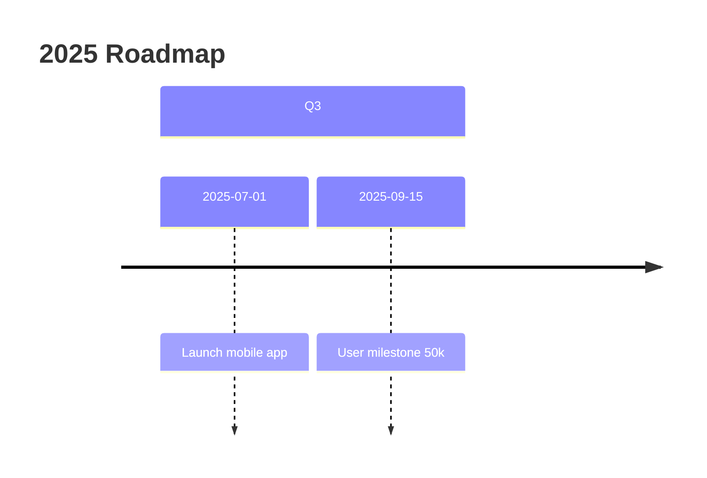

### 13. Pie Chart – Market Share
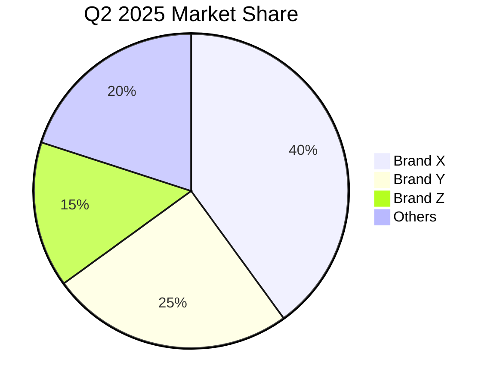

### 14. Quadrant Chart – Risk Matrix
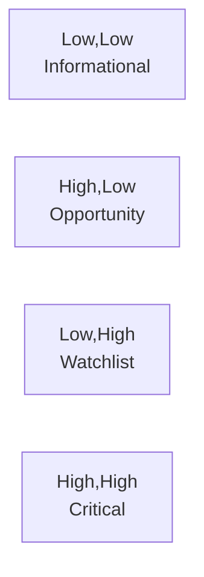

### 15. Sankey Diagram – User Onboarding Funnel
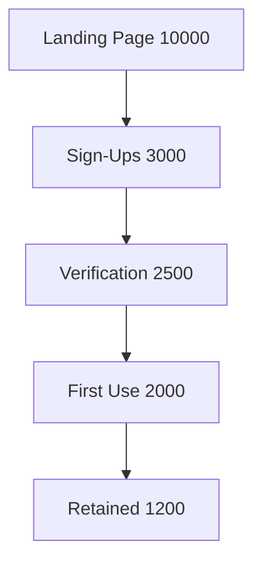

### 16. XY (Scatter) – Sales vs. Marketing Spend
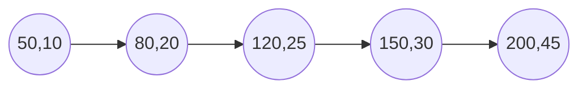

### 17. Block Diagram – System Architecture
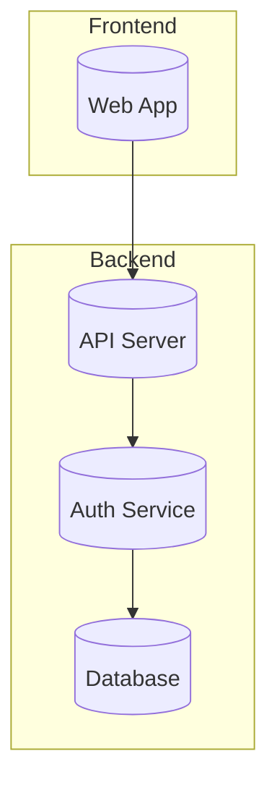

### 18. Packet Diagram – Network Frame
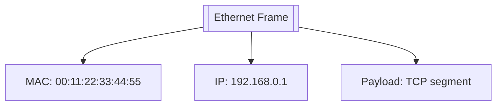

### 19. Kanban Board – Release Tracker
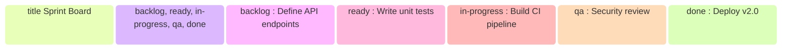

### 20. Architecture Diagram – Service Mesh
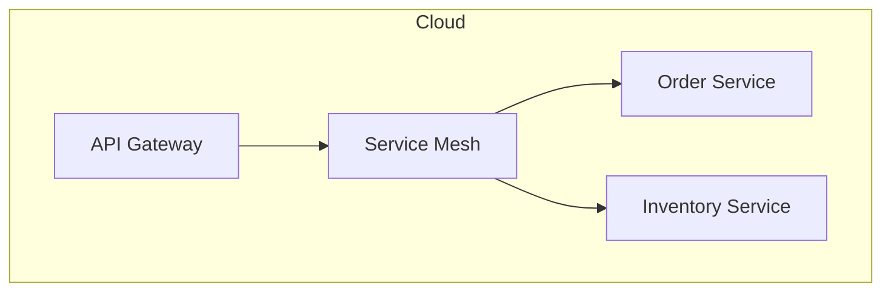

### 21. Radar Chart – Team Skills
```mermaid
flowchart TD
  TeamA --> Backend["Backend: 4"]
  TeamA --> Frontend["Frontend: 3"]
  TeamA --> DB["DB: 5"]
  TeamA --> DevOps["DevOps: 4"]
  TeamA --> UX["UX: 2"]
```

### 22. Treemap – Revenue by Region
```mermaid
pie
  title Revenue 2025
  "North America": 500000
  "Europe": 300000
  "Asia": 200000
  "Other": 50000
```
